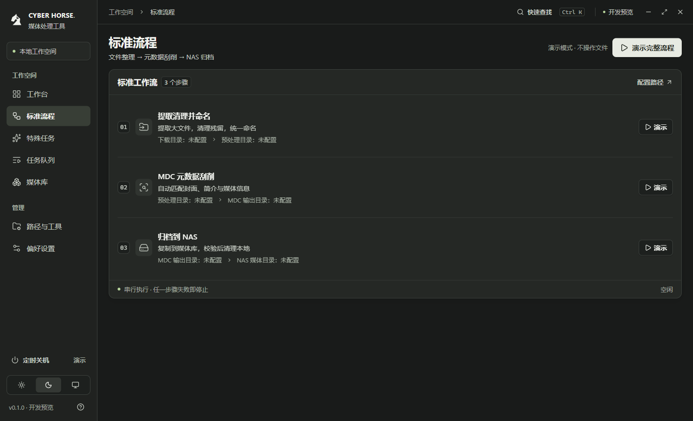
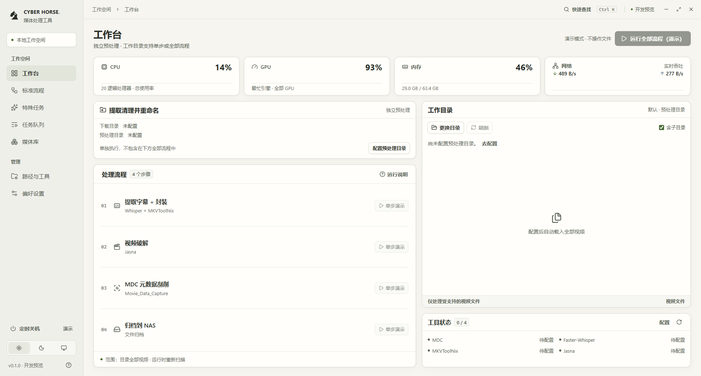

# 06 · 界面精调与验收

日期：2026-09-27。范围：个人桌面工具的七个页面、两种主题、默认/最小/最大化窗口，以及原有交互回归。

本篇为前一轮精调记录。后续根据用户要求将任务与日志集中到任务队列页，并新增五步工作台及性能面板；当前规格与结果见 [07 · 全流程工作台与性能监控](07-全流程工作台与性能监控.md)。

## 审查依据

以用户提供的原界面截图定位问题，并用用户提供的 Codex 桌面截图作为中性色、字重与组件层次的参考。调整后使用真实 Electron 生产构建截图核对，不将效果图作为实现结果。用户截图含其他应用内容，仅保留于忽略目录，不放入公开项目文档。

## 问题与处理

| 编号 | 观察到的问题                                 | 影响                         | 已实施调整                                                                                          |
| ---- | -------------------------------------------- | ---------------------------- | --------------------------------------------------------------------------------------------------- |
| 1    | 多处辅助信息为 9–12px，文字颜色偏弱          | 默认窗口阅读费力，状态难辨   | 正文 15px、步骤名 16px、辅助信息至少 13px；加深浅色文字，提高深色文字亮度，标题和操作采用更清晰字重 |
| 2    | 大主视觉、概览、流程、队列、日志依次纵向堆叠 | 正常操作需要整页上下寻找信息 | 移除主视觉和装饰指标；流程和工具并列，队列和日志并列，整页随窗口高度分配空间                        |
| 3    | 卡片、背景、按钮的明度接近                   | 信息层级与可操作区域不清晰   | 区分画布、侧栏、卡片、输入框；加入轻阴影和边框；主按钮使用最高对比度，导航选中使用实色底            |
| 4    | 宣传语和重复说明占据界面                     | 对个人使用没有信息价值       | 移除口号、装饰卡片和长空态；保留简短功能描述、演示说明和真实状态                                    |
| 5    | 路径设置较长，外观页重复路径表单             | 保存入口距离远，设置职责混杂 | 目录和工具分栏，保存栏固定可见；偏好设置只保留外观与配置说明                                        |

## 真实窗口验证

桌面验证记录位于 `test-results/desktop-smoke-result.json`，自动截图位于同目录。配置使用独立临时目录，未运行参考项目脚本。

- 默认窗口：1480 × 900；本机实际内容尺寸 1479 × 900。两种主题分别检查七页。
- 最小窗口：1060 × 760；本机实际内容尺寸 1059 × 761。检查七页，包含演示完成后的任务数据。
- 最大化：本机可用内容尺寸 1920 × 1032。检查工作台和标准流程。
- 共 24 个布局检查点：整页横纵溢出均为 0；三步流程不需要局部滚动；面板均位于可视工作区内。
- 默认窗口的三条任务可同时看见；最小窗口任务和较长日志允许面板内滚动，标题和操作保留在固定位置。
- 真正完成一次三步演示并取消一次；取消后进度停止，重复启动互斥。验证系统主题跟随、搜索、保存、路径检查、配置恢复、倒计时演示及取消。
- 渲染端运行错误 0；沙箱、上下文隔离、受限桥接保持有效。

正文、次级、辅助文字的令牌分别与画布、侧栏、卡片、输入框、选中背景组合进行静态对比度计算，共 30 组；最低值为 4.54:1。该结果只覆盖这些文本令牌组合，不代表已完成所有控件、状态、读屏及系统高对比度验收。

`npm run check` 通过（9 项行为测试及生产构建）；`npm run test:desktop` 通过。代码与文档采用项目格式检查。

## 调整后截图

### 浅色工作台

### 深色标准流程

### 最大化工作台

## 仍需后续验证

完整读屏、多档 Windows 显示缩放、系统高对比度与安装包发布不在本次验收范围。极窄浏览器面板使用纵向回流；正常 Electron 支持尺寸采用固定工作区。业务仍是演示，不接入实际媒体处理、Emby 或系统关机。
