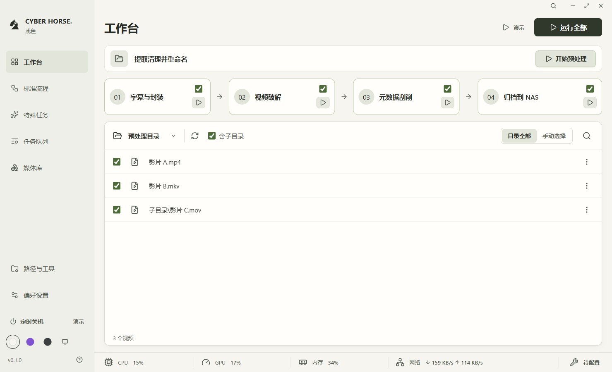
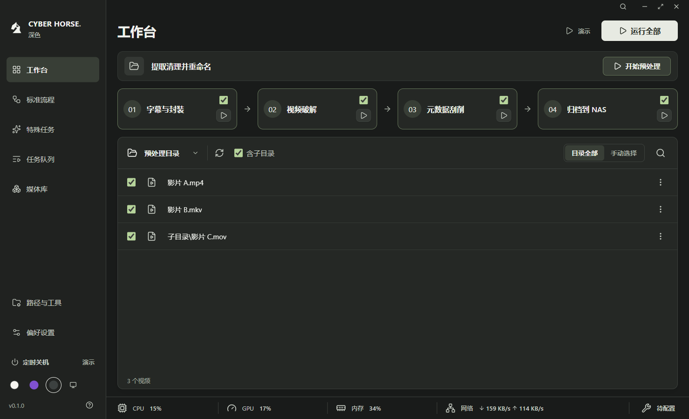

# 07 · 全流程工作台与性能监控

日期：2026-09-27。以个人日常操作为目标，沿用清晰字级与正常窗口无整页滚动的要求。当前布局按第二版初号机方案简化，见 `08-初号机主题与界面简化.md`。

## 当前行为

工作台把准备文件与处理文件分开。顶部“提取清理并重命名”为独立真实预处理：预览并确认后同卷移动至少 1 GiB 的下载文件、规范视频编号，下载残留移入恢复目录，最后移除清单中确实为空的下载子文件夹；不受下方文件选择影响，也不包含在“运行全部流程”中。入口采用“开始预处理”，缺少配置时显示“配置预处理”。完成后刷新文件范围，不自动串起后续流程。规则见 `13-提取清理并重命名.md`。

下方横排处理流程包含四步：

1. 提取字幕 + 封装（Whisper 与 MKVToolNix）。
2. 视频破解（Jasna 入口）。
3. MDC 元数据刮削。
4. 归档到 NAS。

四步的文件夹图标打开当前工作目录，不启动任务；四步流程面板标题行右侧的运行按钮按 01–04 顺序串行运行所选步骤，默认全选，并与上方独立预处理按钮分开。步骤标题和复选框可调整参与范围；部分选择时显示“运行所选 N 步”，清空则禁止运行。需要单步处理时只勾选一个步骤，再点击运行按钮。步骤选择和文件选择互不影响。每次点击运行先重新扫描，再冻结本次范围；扫描中与运行中禁止重复启动、修改步骤及文件范围，运行中可停止。空范围不产生任务。MDC 单步成功后将本次产物搬回预处理目录，并让“仅选中文件”范围继续指向本次产物，以便随后单步归档。

页头提供“运行说明”，说明工作台真实处理范围；底部扳手打开工具状态，点击工作目录名称打开当前文件夹，紧邻的按钮刷新文件清单。四步已接入实际处理，单步分别检查输入、配置、工具及产物；运行前预览确认，按已校验文件数报告进度。每完成一个文件子任务后自动重新读取工作台清单；多个完成事件短时间到达时合并读取，不改变本轮冻结的处理范围。详见 `14-四步真实处理.md`。

**任务列表和运行日志只放在左侧“任务队列”页。** 工作台不重复展示它们。四步队列显示本次冻结的目录、范围类型和数量、工具日志及恢复位置；预处理显示完成项数及恢复记录。切换页面后运行继续，文件选择保留在本次会话。原“标准流程”和“特殊任务”独立页面已移除，操作统一从工作台进入。

## 文件范围

- 默认目录：启动后自动载入已保存的预处理目录。保存新的预处理目录后自动重新载入；没有配置时显示“配置目录”。重启重新读取默认目录，不恢复部分文件选择。
- 点击工作目录名称打开当前文件夹；紧邻的按钮手动刷新。首页不提供临时更换目录入口；在“偏好配置”修改并保存预处理目录。
- 默认范围为“目录全部”，默认启用“含子目录”，可关闭；运行前重新扫描纳入新增视频。字幕与其他文件不单独作为处理输入。
- 勾选或文件菜单的“仅选此文件”切换到“手动选择”，显示“已选 N / 总数”；清空后为零项，禁用运行，不悄悄回退为全部。点击“目录全部”恢复默认范围。
- 工作台直接展示前 100 项，完整清单支持文件名和相对路径筛选、每页 50 项、单选、多选。筛选只改变显示；“全选全部文件”恢复整个目录的全部范围，而非当前筛选页。
- 手动刷新和递归变化保留仍存在的部分选择，不自动添加文件。运行前发现选中文件消失时，中止本次启动、更新清单并提示重新确认；读取失败展示错误和刷新入口，不沿用旧范围启动。
- 启动时复制文件路径及元数据作为快照；运行中新增文件不影响本次范围。空目录显示空态，不可读取项与链接计入跳过数量并提示。
- 仅读取文件名、相对路径、大小；不读取媒体内容，不创建媒体目录，不修改文件。
- 视频扩展名：MP4、MKV、AVI、MOV、WMV、FLV、M4V、TS、MTS、M2TS、WEBM、MPG、MPEG、VOB。字幕和元数据不作为独立视频输入；真实处理接入时另行设计关联规则。
- 不跟随符号链接与目录联接；最多 5000 个视频，最多遍历 100000 项、20 秒。达到上限时拒绝返回不完整的“全部文件”，提示缩小范围。

桌面接口仅接受固定选择类型、目录来源和是否递归。`refreshInputs` 来源仅允许 `preprocess`（已保存的预处理目录）、`download`（已保存的下载目录）、`current`（主进程记住的原生选择目录），渲染端不能直接传入路径。`openWorkDirectory` 仅接受预处理目录、当前原生选择目录和四个输出目录的白名单键，主进程验证为可访问文件夹后交给系统文件管理器。预处理扫描不会覆盖主流程的目录。测试使用隔离的空白视频扩展名样本，不接触真实媒体。

## 性能指标

| 指标 | 来源与显示口径                                                                   | 状态处理                                                     |
| ---- | -------------------------------------------------------------------------------- | ------------------------------------------------------------ |
| CPU  | Node 系统 CPU 累计时间的相邻采样差；所有逻辑处理器总利用率                       | 首次采样显示“采样中”，不伪造 0%                              |
| 内存 | 系统总物理内存减空闲内存；同时显示占比和已用 / 总量                              | 实际系统数值                                                 |
| GPU  | Windows `GPU Engine` 性能计数器；同一硬件引擎跨进程求和，再取全部 GPU 中最忙引擎 | 驱动、权限或计数器不支持时显示不可用；悬停可查看显卡名称     |
| 网络 | 具有单播地址的活动网卡累计收发字节差值；排除回环、隧道和重复过滤驱动接口         | 显示下载 / 上传 Byte/s；新网卡建立基线，计数器重置不产生尖峰 |

应用公共底部状态栏在工作台、任务队列、媒体库和偏好配置页常驻展示当前值，点击对应指标打开性能详情，展示最近 40 次采样的趋势。约每 2 秒采集，实际间隔受系统计数器开销影响；网速按实际时间差计算。多个活动网卡合计可能包含虚拟网卡，不应理解为某个互联网连接的独立带宽。

GPU 使用独立隐藏的 Windows PowerShell 子进程，执行固定只读脚本，批量读取计数器，不接受任意命令，不修改系统配置或申请提权。CPU 与内存采样在主进程中独立进行；GPU 和网络不可用不会阻止界面使用。

切换应用内页面时保持采样与最近 40 次趋势；页面不可见时，前端停止请求；10 秒无请求后清理采样计时器和子进程。15 秒没有新计数器数据时降级并终止卡住的采集进程，失败后最多每 30 秒重新启动一次采集；应用关闭时立即清理。

这些值属于任务管理器同类指标，**不承诺与任务管理器逐位一致**：CPU 算法和采样窗口不同，内存包含缓存等统计差异；GPU 展示所有设备中的最忙引擎；网络以 Byte/s 为单位，系统页面可能使用 bit/s。

官方参考：[Node 系统接口](https://nodejs.org/api/os.html#oscpus)、[微软 GPU 统计口径](https://devblogs.microsoft.com/directx/gpus-in-the-task-manager/)、[Windows 性能计数器](https://learn.microsoft.com/en-us/windows/win32/perfctrs/about-performance-counters)、[批量读取计数器](https://learn.microsoft.com/en-us/dotnet/api/system.diagnostics.performancecountercategory.readcategory?view=netframework-4.8.1)。

## 验证与边界

- 单元行为验证：CPU 差值、网卡增量/重置/新增、目录递归、媒体过滤、重复文件、不可读路径、链接排除、枚举上限、输入校验、运行范围快照，加上原有配置与任务状态机，共 17 项（含主题兼容与持久化）。
- 原生 Electron 集成：受限桥接；默认目录自动加载、单选/多选/清空/全部、递归及刷新保留选择；运行前新增文件、运行中快照与逐项完成刷新、选中文件消失、读取失败与恢复；独立预处理、四步串行完成、单步和取消；文件原文保持不变。
- 自动验证只替换原生文件对话框的返回值，以便使用隔离样本；枚举、校验、界面及 IPC 使用实际实现。系统选择器本身仍需人工交互检查。
- 已通过 `npm run check`、`npm run format:check`、`npm run test:desktop`。初号机、深浅主题、系统跟随、各窗口尺寸和运行状态的最新验证见 `08-初号机主题与界面简化.md`；此前 26 个布局检查点无整页溢出；渲染错误为零。已目视检查深浅截图及最小窗口，另验证系统主题跟随、键盘单选、弹窗 Esc 关闭与焦点恢复、筛选不改变范围和空目录不启动。记录见 `test-results/desktop-smoke-result.json`。
- 在本机已取得 CPU、内存、GPU 和 WLAN 网卡采样；检测到 NVIDIA GeForce RTX 4070 与 Intel Graphics。采样结果存于忽略目录的桌面验证记录，不作为固定演示数据。
- 外部媒体引擎、安装包签名、多档系统缩放和完整读屏测试仍未完成。

## 当前截图

