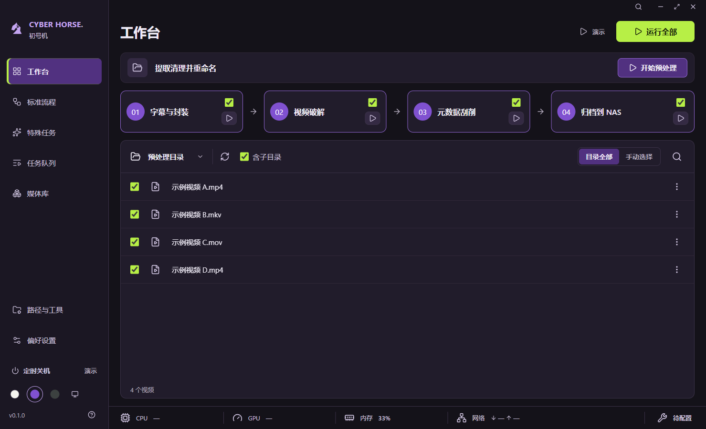

# 08 · 初号机主题与界面简化

日期：2026-09-27。视觉依据为用户从三份设计中选择的第二版初号机方案。

## 已实现

- 左上角采用重新绘制的几何马首标志，右侧居中排列较小的全大写「CYBER HORSE」；不再展示主题名称，主题切换仍位于左下角。
- 新增初号机主题：黑紫背景、紫色导航及编号、荧光绿运行按钮与勾选；侧栏圆点和偏好设置均可切换。新配置默认初号机，旧主题和路径保持兼容。
- 工作台由独立预处理条、横排四步流程、文件清单及底部状态栏组成。步骤卡片使用文件夹图标打开各自配置的输出目录，页头保留说明入口，运行按钮位于四步流程面板；后续优化已加入步骤勾选和明确的预处理文字按钮，见 `09-步骤选择与预处理入口.md`。
- 移除工作台和其他操作页的功能介绍、目录流向、工具英文副标题及重复提示。完整路径、工具详情和性能趋势按需展开。
- 目录默认预处理目录；目录按钮可更换和恢复。默认“目录全部”，手动选择、复选框和文件菜单支持单选、多选；清空后不扩大范围。
- 性能摘要来自原有本机采样，点击打开趋势；未采样和不可用保持占位。工具状态只反映配置和路径检查，不宣称真实引擎可用。
- 保留原有队列、日志、文件清单筛选、路径配置与关机倒计时演示；中文提示、键盘焦点和弹窗关闭正常。全局页面搜索已在后续界面调整中移除。

独立预处理及工作台四步均已接入预览确认后的真实执行，详见 `13-提取清理并重命名.md` 和 `14-四步真实处理.md`。下面的验证记录为当时界面版本。

## 验证结果

- `npm run check`：类型检查、17 项行为测试与生产构建通过。新增主题兼容和持久化测试；构建仅有现有 Zod 注释提示，无构建错误。
- `npm run format:check`：通过。
- `npm run test:desktop`：通过。七个页面的三种配色、系统跟随、默认与最小窗口、最大化、载入文件及流程完成状态，共 35 个布局检查点，整页无溢出，渲染错误为零。
- 递归、筛选、单选、多选、清空、运行前刷新、运行中快照、文件消失、读取失败和恢复均通过；文本样本保持原文，未操作真实媒体。首页临时切换目录入口已移除，目录改由偏好配置保存。
- 验证预处理独立、四步串行、单步、取消、互斥启动；演示说明、性能与工具弹窗、Esc 关闭与焦点恢复正常。
- 已目视核对初号机、浅色、深色、最小窗口、最大化及完成状态截图。修复步骤完成标签越界和窄窗口底部状态栏横向溢出。
- 设计参考为 1608 × 978；另用同尺寸原生应用截图对照。运行 `node scripts/design-preview.mjs --keep-open` 可打开隔离配置的桌面预览，四个文件为文本样本，性能取本机实际值。

详细记录位于 `test-results/desktop-smoke-result.json` 与根目录 `design-qa.md`。测试输出目录不提交。系统选择器本体、完整读屏、高对比度、多档系统缩放、真实引擎、打包及签名未在本轮验证。

## 界面

## 2026-09-30 · 四主题与暖色强调色

- 左下角顺序固定为浅色、深色、初号机、钢铁侠，移除跟随系统入口和系统配色监听。新配置仍默认初号机；旧版本 1／2 的 `system` 主题迁移为初号机，其他有效字段保持并原子写回。
- 浅色主强调色为陶土橙 `#b54b18`，深色为柔和杏橙 `#efad68`，同步调整悬停、浅底、边框及选中导航。钢铁侠采用深炭灰背景、装甲红导航与步骤编号、金色主操作和红金双色圆点。正文及初号机配色保持原样。
- `npm run check` 通过：309 项测试通过、1 项真实工具测试按约定跳过，类型检查与生产构建通过。迁移测试覆盖两种旧配置版本、保留路径、拒绝继续保存系统主题及钢铁侠跨实例恢复。
- `node scripts/desktop-themes.mjs` 通过：四主题顺序、键盘切换、即时保存、系统配色切换不影响选择、钢铁侠重启恢复；工作台、任务队列和偏好配置覆盖默认／最小／最大化共 36 个布局检查点，无整页溢出。已目视核对全部主题默认工作台，以及浅色最小工作台、钢铁侠最小配置和深色最大化配置截图，中文完整、按钮与底部留白正常。截图与结果位于 `test-results/themes`。
- 本轮完整 `npm run test:desktop` 已执行，但在预加载白名单清单断言处失败：当前接口新增 `cancelShutdown`、`getShutdownState`、`startShutdown`，原断言清单尚未同步。该阻塞发生在主题测试之前，不能称整套桌面回归通过。本轮不修改关机业务或相关断言，未执行真实关机、媒体处理、打包或签名验收。
- 最终 `npm run format:check` 未通过：同一工作区的 `src/main/index.ts`、`src/main/media-ipc.ts`、`src/renderer/src/components/ShutdownControl.tsx` 有格式问题；主题相关改动已格式化。工作期间关机相关文件仍在变化，此结果不能替代其后续验证。

## 2026-09-30 · 全局强调色复查与 Dracula 深色

本次按用户新反馈替代上一轮暖色方案。浅色改为中性灰白底色与深蓝 `#245cc5` 主强调，按钮文字对比度约 6.15:1；深色参考用户提供的 Warp Dracula 截图，灰紫画布 `#282a36`、粉色强调 `#ff79c6`，选中导航为粉底深色字，主按钮文字对比度约 5.97:1。钢铁侠的面板改为炭黑红层次，导航与编号保留装甲红，勾选和主操作统一金色。初号机保持原配色，四项顺序不变。

复查发现旧 `--green` 同时用于主题交互与成功状态，导致文件勾选、下拉对勾等遗漏。本次移除该共用令牌：文件选择、全选／半选、递归选项、设置复选框、弹窗确认、单选、下拉对勾、焦点、运行状态与进度、性能主曲线、收藏、榜单强调和普通提示统一使用 `--accent`；已完成、路径可用与成功日志使用独立 `--success`。播放器黑色覆盖层继续使用白色高对比度控件，浅色主题的媒体封面强调另设适合暗底的蓝色。

验证：`npm run check` 通过（323 项通过、1 项真实工具测试按约定跳过，类型检查与构建通过）；完整 `npm run test:desktop` 通过，包含队列、媒体播放器、开发模式播放与关机替身。`node scripts/desktop-themes.mjs` 通过四主题切换／保存／重启、全选与半选、键盘焦点及下拉菜单交互，36 个默认／最小／最大化页面布局检查通过；已目视核对深浅与钢铁侠工作台、三主题下拉对勾及设置复选框、深色最小窗口截图，交互强调色一致、中文完整。热门推荐专项也通过四主题及三种窗口检查。截图位于 `test-results/themes` 和 `test-results/media-popular`。本轮未重新打包、签名或处理真实媒体；关机仅使用替身。

## 2026-09-30 · 钢铁侠低饱和红黄配色

根据用户连续反馈，最终降低大面积红色饱和度，采用灰调酒红画布 `#30272a`、侧栏 `#392c30` 与面板 `#423237`；装甲红集中用于选中导航 `#87353f` 和步骤编号 `#a6414c`，浅暖白文字 `#fff5ee` 与红灰面板拉开明暗差。主强调色由旧金色改为明黄色 `#ffe047`，悬停为 `#ffec80`，按钮、全选／半选、下拉对勾、焦点和主题圆点同步更新。主按钮文字对比度约 11.02:1。其他主题保持原配色。

验证：`npm run check` 通过（324 项通过、1 项真实工具测试跳过），最终配色的生产构建、`npm run format:check`、主题专项与完整 `npm run test:desktop` 均通过。主题专项覆盖四种主题及 36 个窗口布局检查，已查看深浅工作台、钢铁侠工作台／下拉菜单／最小窗口配置截图，中文完整、亮黄勾选与文字清晰。第一次完整回归在媒体收藏按钮被封面拦截时超时，最终配色重新运行后完整通过；未修改该媒体交互。本轮未重新打包或签名，媒体与关机仅使用隔离数据及替身。

## 2026-09-30 · 启动主题闪烁修复

新配置默认初号机，已有配置恢复已保存主题。启动窗口原来只等待 Electron 首帧可绘制，此时配置可能尚未恢复。现改为先隐藏窗口，等配置读取、主题应用与一帧绘制完成后再首次显示，避免露出默认主题或空白底色。主题在绘制前应用；HTML 默认主题也为初号机。新增无参数、校验来源的 `windowReady` 白名单通知，重复通知不唤回最小化窗口，启动中的第二实例不提前显示窗口；业务界面出错时仍显示恢复界面。

验证：`npm run check` 最终通过（334 项通过、1 项真实工具测试跳过），首次执行有一项任务处理并发等待测试超时，未改动该测试，复跑通过。`npm run format:check` 和完整 `npm run test:desktop` 通过；新加入完整桌面命令的 `desktop-theme-startup.mjs` 使用独立启动器延迟真实配置响应 500ms，记录第一次显示时的配置完成状态、主题和不透明底色，覆盖首次默认初号机、四主题恢复、坏配置提示、启动中第二实例以及重复通知不唤回最小化窗口。已目视核对初号机、深色、浅色首屏截图，中文和布局正常；记录与截图位于 `test-results/theme-startup`。未重新打包或验证签名，真实媒体与关机未执行。
