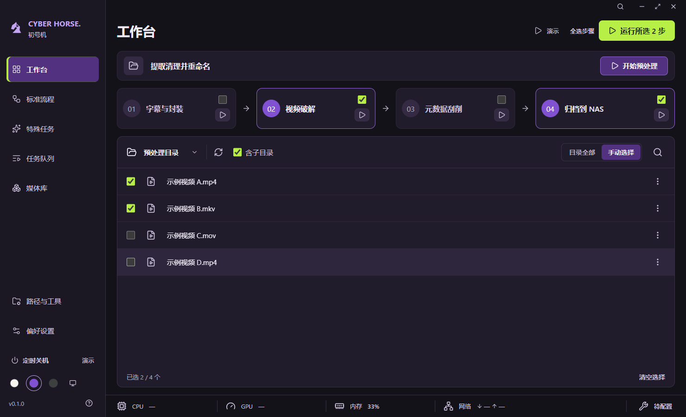

# 09 · 步骤选择与预处理入口

日期：2026-09-27。延续第二版初号机方案，根据反馈增强预处理入口，并兼容部分流程执行。

## 当前交互

2026-09-30 调整：移除页标题下的独立预处理栏，四步流程面板上移至与其他页面一致的内容起点。文件列表移除“预处理目录”文字，保留文件夹图标、路径悬停提示及中文无障碍名称。“文件预处理”位于文件夹图标右侧，采用扫把图标，文件夹、扫把和刷新三个按钮统一为 26px 图标和 40 × 40px 点击区域，背景与悬停效果一致；不显示文字和描边，悬停提示名称及提取清理并重命名用途，保留中文无障碍名称，结果显示在列表底部。缺少下载或预处理目录配置时仍以扫把图标提示“配置预处理”，点击进入路径设置。预处理始终独立执行，不受四步勾选和工作台文件选择影响。

四步流程组成独立面板：标题、真实选中步骤数和“全选步骤”位于左侧，主运行按钮位于面板标题行右侧，下方四张等宽步骤卡片按顺序排列。预处理入口与批量运行入口分属不同分组，不保留悬空的运行按钮行。文件列表“文件名”前新增全选框，覆盖完整目录清单，部分选中显示半选；取消全选保持空选择并禁止运行，空目录、读取失败及运行中禁用全选框。

四个步骤默认全选。点击步骤名称、编号或底部“参与流程”复选框可切换参与状态；勾选与边框一起表达选择，编号 01–04 始终保留。底部文件夹图标打开当前工作目录，不改动当前勾选组合。需要单步运行时，只勾选一个步骤，再点击流程面板运行按钮。

| 步骤选择     | 流程面板主按钮   | 行为                           |
| ------------ | ---------------- | ------------------------------ |
| 四步全部选中 | 运行全部         | 按 1 → 2 → 3 → 4 运行          |
| 选中部分步骤 | 运行所选 N 步    | 只运行选中步骤，按原顺序执行   |
| 全部取消     | 请选择步骤，禁用 | 不生成批量任务，不回退到全流程 |

部分选择和零选择时提供“全选步骤”恢复入口。无论勾选顺序如何，选 4 再选 2 仍按 2 → 4 执行。步骤范围与文件范围独立：选择 2、4 和两个文件，队列仅包含这两个步骤，处理范围仅为这两个文件。

运行时冻结所选步骤，重新扫描并冻结文件清单；运行中禁止修改步骤、文件范围和重复启动。完成、取消和切换页面保留本次组合，重启恢复四步全选。零步骤时运行按钮禁用；文件夹图标在已配置目录时仍可使用。

## 实现与边界

组合保存在工作空间会话状态，不增加配置字段。启动方法按固定步骤定义过滤选择，空步骤在扫描前拒绝。打开文件夹通过受限桌面接口读取对应的已保存配置，不能传入任意路径。预处理保持原有独立读取下载目录的行为。

四步和独立预处理均已接入实际处理，按 `13-提取清理并重命名.md` 与 `14-四步真实处理.md` 预览确认后执行。每步独立检查输入和工具，缺少条件报错，不补跑未选步骤。

## 验证

### 2026-09-30 入口与文件全选调整

- 工作台专项桌面验证通过：103 项跨列表显示上限的全选、取消全选后禁止运行、行选择与半选联动、空格键全选、空目录禁用、预处理配置入口及预览取消后文件不变。
- 默认 1480 × 900、最小 1060 × 760 和最大化窗口，分别检查初号机、深色、浅色和跟随系统，共 12 组布局无整页溢出、无渲染错误；系统深浅切换正常。已目视检查初号机默认窗口、浅色最小窗口和深色最大化截图，中文、按钮位置和底部留白正常。截图及专项结果位于 `test-results/workbench-update`。
- 统一文件夹、扫把与刷新按钮尺寸后重新验证：`npm run check` 通过（301 项测试通过、1 项跳过，类型检查与生产构建通过），`npm run format:check` 通过。
- `npm run test:desktop` 本轮完整通过，包括工作台、预处理、媒体库、任务队列和开发模式播放验证。三个等尺寸入口的 12 组窗口与主题专项检查通过，已目视复核初号机默认窗口和浅色最小窗口，图标与刷新按钮对齐，中文显示正常。未验证打包、签名或真实媒体工具集成。

### 2026-09-27 原步骤选择验证

- `npm run check`：类型检查、17 项行为测试、生产构建通过。
- `npm run format:check`：通过。
- `npm run test:desktop`：通过；39 个布局检查点无整页溢出，渲染错误为零。
- 新增桌面验证：预处理配置入口与开始按钮、步骤默认全选、零项禁止批量启动、未选步骤独立运行、不连续组合的固定顺序、部分文件与部分步骤一起运行、运行中锁定、页面切换保留、全选恢复、重启恢复默认，以及空格键切换复选框。
- 已目视检查初号机、浅色、深色和最小窗口的部分选择状态；已有系统跟随、最大化和文件安全边界验证继续通过。
- 预览脚本另验证点击步骤名称能够切换选择，并展示仅选 2、4 与两个文件的状态。
- 真实引擎、打包、签名、多档系统缩放和完整读屏仍未验证。

