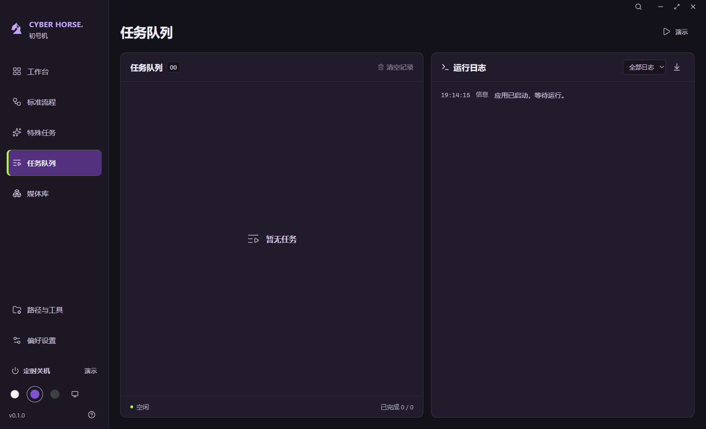
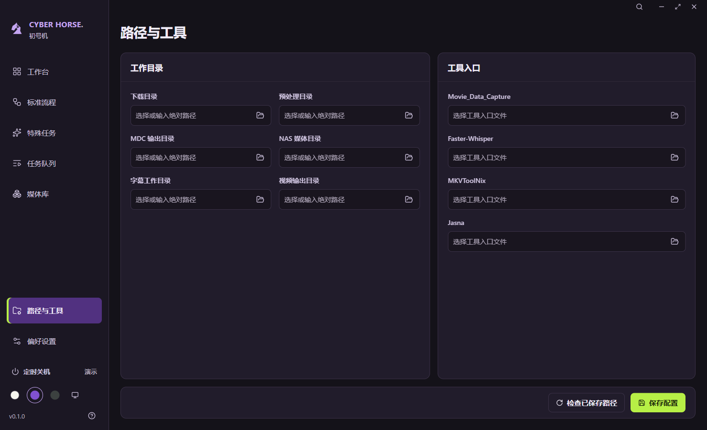
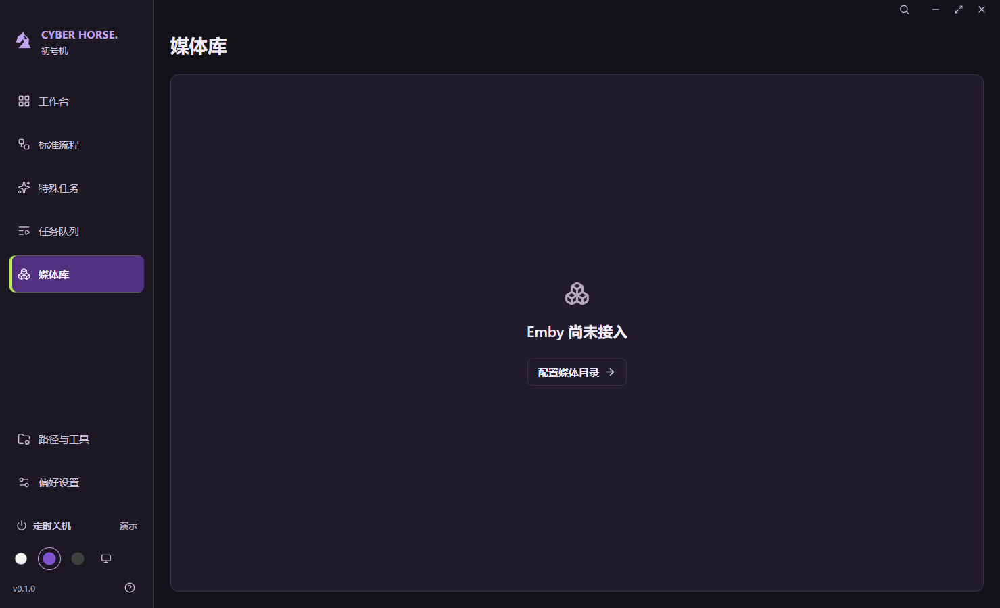

# 10 · 页面布局与底部对齐

日期：2026-09-27。处理任务队列、媒体库、路径与工具等页面底部贴边和局部间距不一致的问题。

## 问题与修改

此前普通页面共用了工作台的零底边距，最大化和短窗口规则也再次将底部留白清零。结果是任务和日志面板、媒体库面板、路径保存栏贴住窗口底边。面板内部又分别使用 15、17、18、20、21、22、24px 等边距，标题、表单、页脚和偏好设置两张卡片缺少共同基线。

本次在 `tokens.css` 统一定义页面边距、区域间距、面板内边距和标题栏高度，移除相互覆盖的页面留白规则。

| 区域                             | 默认及最大化 | 窄窗口        |
| -------------------------------- | ------------ | ------------- |
| 普通页面左右与底部               | 24px         | 18px          |
| 面板标题、正文和页脚的水平内边距 | 20px         | 16px          |
| 面板标题栏                       | 至少 60px    | 至少 60px     |
| 页面区域间距                     | 16px         | 短窗口为 12px |

- 工作台状态栏保留贴底，其余页面使用统一底边距。
- 任务和日志面板的外边缘、标题栏对齐；正文与任务底栏共用面板内边距。
- 媒体库空态在带留白的内容面板内居中。
- 路径与工具的两列表单行距统一；保存栏使用同一面板圆角与边框，按钮靠右。长表单在面板内滚动，保存区始终可达。
- 偏好设置两张卡片共用标题栏结构，文字基线与分隔线对齐。
- 标准流程同步内容内边距，特殊任务的底部运行按钮统一靠右。

本轮只调整布局和样式，不新增媒体处理、媒体库或系统能力。

## 验证范围

桌面验证覆盖全部七页的默认窗口三种配色、最小窗口、最大化及系统跟随；保存页面底边距和工作区底部距离用于目视复核，不为具体像素数增加机械样式断言。增加长表单末项的键盘聚焦检查，确认面板滚动后字段与保存按钮均在可视区域。

处理仍为演示；真实引擎、打包签名、多档系统缩放和完整读屏不属于本轮已验证能力。

## 验证结果

- `npm run check`：类型检查、17 项行为测试及生产构建通过。
- `npm run format:check`：通过。
- `npm run test:desktop`：44 个布局检查点通过，渲染错误为零。默认及最大化的普通页面底部为 24px，窄窗口为 18px；工作台状态栏保持贴底。
- 已目视检查任务队列、媒体库、路径与工具和偏好设置的初号机、浅色、深色截图，以及最小窗口和最大化结果。确认面板边界、底部留白、标题栏及保存区对齐，中文完整。
- 长表单末项及首项通过键盘聚焦可达，滚动局限于表单面板，保存按钮保持可见。
- 首次桌面验证遇到演示计时完成等待超时。测试进程关闭后台计时节流后重新完整运行通过；生产启动未修改。同时增加失败现场截图和状态记录，便于后续定位。

