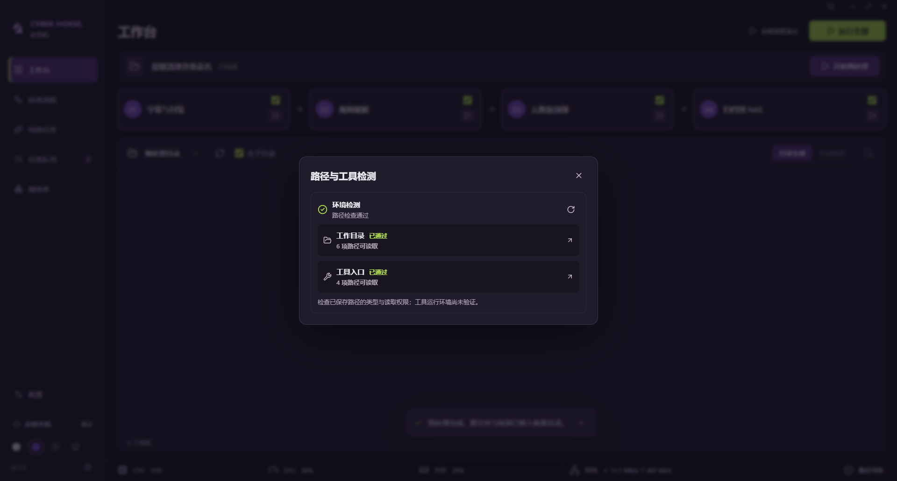

# 12 · 首页环境检测

日期：2026-09-27。

## 行为

- 应用启动后检查已保存的六项工作目录与四项工具入口。所有页面共用固定的应用底部状态栏，右下角路径状态汇总十项检查结果，检测期间显示旋转图标；点击后在状态弹窗中查看详情与扫描动效，不使用模拟百分比或人为等待。状态栏独立于页面内容，任意页面都可打开检测详情、手动复检及跳转配置字段。
- 状态弹窗将目录、工具分开显示状态、问题数及首个问题；全部通过仅表示路径检查通过。鼠标点击或键盘操作可进入“配置 → 路径与工具”，聚焦并滚动到相应字段。已配置但失效或超时的路径优先于未配置字段。
- 每个配置输入框下显示具体原因。修改草稿后显示“未保存，保存后自动检测”；点击保存或外部编辑配置后自动复检。主题及无关配置变化不触发复检。
- 支持手动重新检测；检测进行中禁用重复检查，返回工作台会重新检查，以发现目录断开或入口文件被移动。
- 检测服务失败、超时及浏览器预览有明确文字，不沿用旧的通过状态；可以重试或前往配置。损坏配置文件在首页提供单独修复入口。
- 保留现有预处理、步骤选择和文件范围；所有媒体处理仍为演示。

## 检测范围与实现

共享 `HealthItem` 契约在原有未配置、无效、可读取状态之外增加 `unavailable`，表示单项读取超时，无法确认状态。主进程验证绝对路径、读取权限及文件或文件夹类型；每项最多等待 5 秒，其他项独立检查。不会创建目录、启动工具、执行脚本或改动媒体。

工具入口可读取不代表工具版本、模型、依赖和处理参数已通过验证；当前不进行真实工具运行能力探测，界面保留该边界说明。

渲染端用独立检测钩子处理加载、失败、8 秒总超时与浏览器不支持状态。同一配置的进行中请求复用；配置变更或卸载会取消等待并丢弃旧响应。系统文件读取不能强制中止，迟到结果不会覆盖超时或更新后的结果。预加载与 IPC 白名单保持不变。

## 界面与验证

状态按钮和弹窗使用现有语义颜色、字号、面板间距；默认窗口和最小窗口中保持文件区局部滚动。扫描、旋转和结果动效遵循 `prefers-reduced-motion`，关闭动画时仍有完整状态文字。

跳转后的路径输入框使用覆盖整行（含目录按钮）的单层焦点轮廓，不再叠加内部输入框轮廓；目录按钮仍保留键盘焦点标识。浏览器预览明确提示使用独立配置、未读取桌面配置文件，避免将预览空值误认为桌面设置丢失。

验证覆盖实际目录与入口文件的读取、入口消失、路径类型错误、键盘跳转与精确字段聚焦、保存后自动恢复、重复检查互斥、失败重试、超时与旧响应丢弃。慢响应和检测服务失败使用 IPC 替身，普通路径读取使用隔离文件中的真实服务，不执行真实工具。

配置同步回归额外覆盖：遗漏推送后通过窗口焦点重新读取磁盘、保留无关草稿、旧读取响应不覆盖新推送、读取失败持续提示及重试恢复。各主题截图保留配置输入框焦点，验证整行轮廓不与内部输入框叠加。

- `npm run check`：类型检查、52 项行为测试及生产构建通过。
- `npm run format:check`：通过。
- `npm run test:desktop`：通过，48 个布局检查点无溢出，渲染错误为零；新检测场景、系统主题跟随、减少动画偏好及原有交互通过。
- 已目视检查初号机、深色和浅色截图，以及最小窗口、最大化、检测中与失败状态。新增模块中文完整；文件区局部滚动，配置字段可通过键盘访问，底部保存区保留页面留白。

打包、签名、真实工具运行环境、完整读屏和多档系统缩放未验证。
