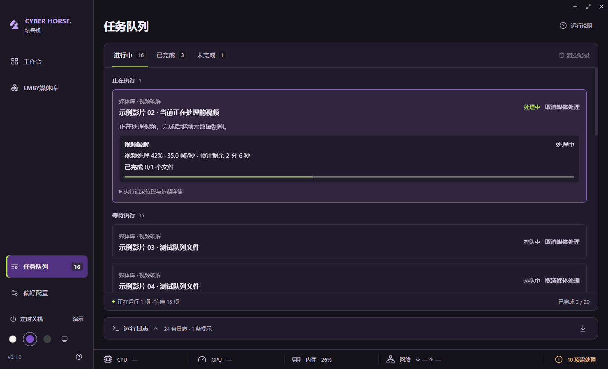
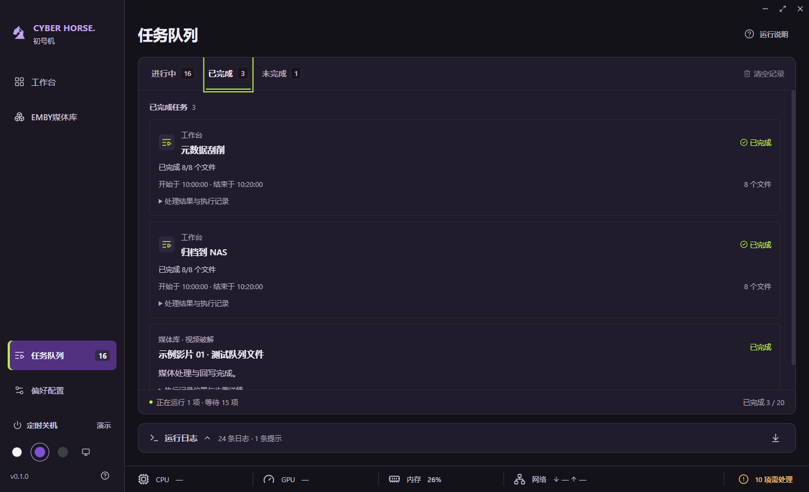

# 16 · 任务队列聚焦与日志折叠

> 后续队列与恢复交互见 [17 · 任务工作目录与恢复开发计划](17-任务工作目录与恢复开发计划.md)。多批次统一状态、启动恢复提示和移除确认尚未接入；本页以下描述当前会话内队列行为。

日期：2026-09-29。

## 页面行为

- 默认显示“进行中”。工作台步骤、媒体库复合任务和独立下载使用同一状态分组，正在执行的任务置于等待任务之前，等待任务保留主进程返回的调度顺序。
- 成功任务自动从进行中移入“已完成”；失败、取消、中断与跳过保留在“未完成”。标签显示对应数量，完成时不主动切换用户正在查看的标签。
- 当前执行任务使用主题强调边框，展示任务名称、来源、实际处理阶段、可用的进度与速度。工具未报告百分比时保持未定进度。排队项只保留名称、来源、状态和取消入口。
- 媒体复合任务的下载子项仍合并到所属任务，不重复计数。只展开当前执行步骤，其余步骤与执行记录放入折叠详情；工作台输出路径和执行记录同样按需展开。
- 任务使用单一局部滚动区，避免旧页面中工作台步骤、媒体任务互相挤占高度。三个标签支持左右方向键、Home、End；切换标签回到该列表顶部。
- 运行日志放在页面底部，默认收起；收起时显示会话内保留的日志数量与提示数量，仍持续收集。展开后在独立区域滚动，保留筛选、跟随最新日志和导出。
- 读取媒体状态失败时显示重试提示，不将未确认状态显示为空任务；读取成功后自动恢复。清空记录在初始读取、读取失败和任务运行期间禁用。清空期间忽略旧轮询结果，避免记录重新出现。

## 保留的边界

本次只调整任务展示与交互，不新增处理能力或跨重启历史恢复。工作台仍展示最近一次预处理或四步任务；新运行会替换上次工作台步骤。清空记录仍清除全部已结束的展示记录，已下载文件、临时文件与磁盘执行记录不受影响。

没有新增依赖、IPC 能力或文件操作。所有任务状态仍由现有服务投影，浏览器演示任务保留明确标识。

## 验证

- 行为测试覆盖混合任务分组、运行优先、等待顺序、关联下载去重、失败与取消归类，以及只展开当前处理步骤。
- 专项桌面验证使用隔离配置与 IPC 状态替身构造长队列，覆盖实时完成移出、取消等待、状态读取失败恢复、未知进度、键盘标签切换和日志折叠。
- 主题覆盖初号机、深色、浅色及跟随系统的深浅切换；窗口覆盖 1480 × 900、1060 × 760 与最大化，并检查日志展开后的布局。截图保存在 `test-results/队列改版-*.png`。
- 原桌面联通验证同步切换到对应状态标签，并继续验证真实 IPC、工具替身、下载取消和源文件保护。
- 打包、签名、真实模型处理与真实 NAS 写入不属于本次验证。

## 验证结果

- `npm run check` 通过：类型检查、163 项行为测试、生产构建。
- `npm run format:check` 通过。
- `npm run test:desktop` 通过：完整桌面联通、队列专项交互、开发模式播放与旧后台兼容验证，渲染错误为零。
- 已目视检查初号机、深色、浅色截图，以及最小窗口、最大化、日志展开与已完成视图；任务和日志均在各自区域滚动，底部留白正常，中文完整。

